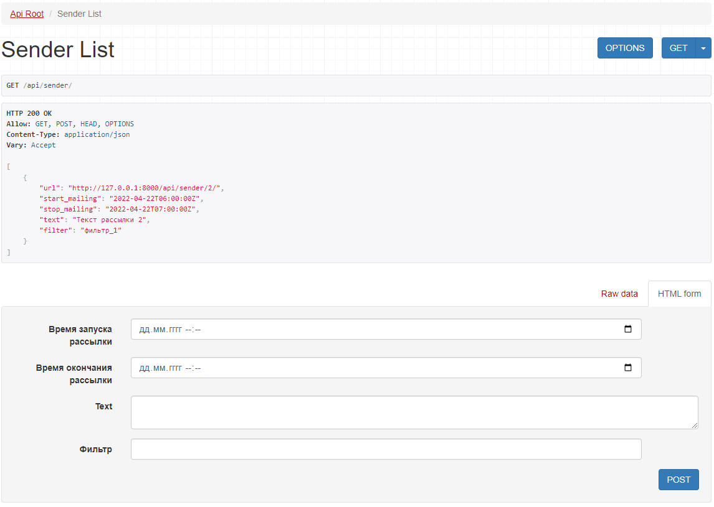

# Notification service

## Установка
```bash
python3 -m venv .venv
. .venv/bin/activate
pip install -r requirements.txt
```
Переименуйте файл ".env.exsample" в ".env" и введите необходимые данные.


## Запуск


* Выполните миграции # ```python manage.py makemigrations```
* Примените миграции # ```python manage.py migrate```
* Создайте пользователя # ```python manage.py createsuperuser```

Выполните команду, для старта проекта и запуска локального сервера
```python manage.py runserver```

## Использование
* http://127.0.0.1:8000/admin # адрес для входа в админ панель
* http://127.0.0.1:8000/api/ # список url адресов API
* http://127.0.0.1:8000/api/client # список клиентов
* http://127.0.0.1:8000/api/sender # список рассылок



* Запуск celery `celery -A not_service worker -l info`
* Запуск celery beat `celery -A not_service beat -l info`


## Дополнительные задания

* п. 3. Запуск сервиса с помощью **docker-compose**.
Выполните команду `docker-compose up --build`
или `docker compose up --build`

* п. 5. http://127.0.0.1:8000/docs # По этому адресу открывается страница со Swagger UI с описанием разработанного API.
