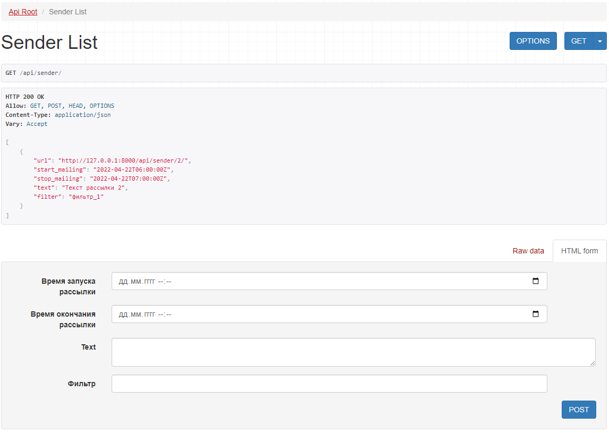

# Notification service

## Установка
```bash
python3 -m venv .venv
. .venv/bin/activate
pip install -r requirements.txt
```
Переименуйте файл ".env.exsample" в ".env" и введите необходимые данные.


# Запуск

Выполните команду
```python manage.py runserver```

* Выполните миграции
* Примените миграции
* Создайте пользователя

## Usage
http://127.0.0.1:8000/admin # адрес для входа в админ панель
http://127.0.0.1:8000/api/ # список url адресов API

http://127.0.0.1:8000/api/client # список клиентов

http://127.0.0.1:8000/api/sender # список рассылок



## Docs
